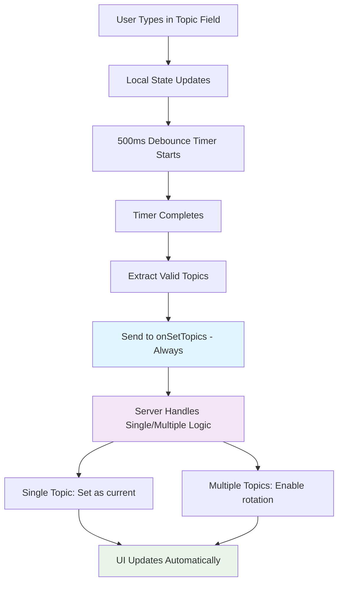
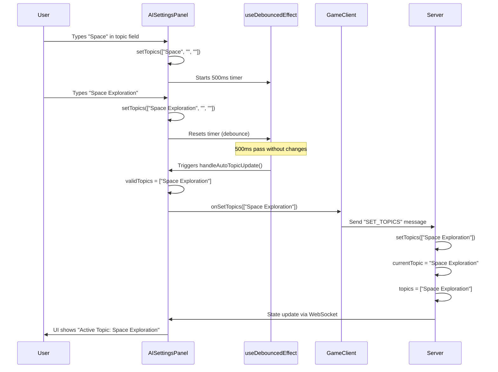

# Topic Management Refactoring: Automatic Updates Implementation Plan

## Overview

This document outlines the implementation of automatic, debounced topic updates for the AI Settings Panel, replacing manual "Apply" buttons with a seamless real-time experience.

---

## Current State Analysis

### 🔍 **Current Topic Management (HEAD)**

```typescript
// AISettingsPanel.tsx - Manual apply patterns
const handleTopicApply = (index: number) => {
  const topicToSet = topics[index]?.trim();
  if (onSetTopic && topicToSet && topicToSet !== gameState.currentTopic) {
    onSetTopic(topicToSet);  // Single topic path
  }
};

const handleTopicsApply = () => {
  const validTopics = topics.filter(t => t.trim().length > 0).map(t => t.trim());
  if (validTopics.length > 0 && onSetTopics) {
    onSetTopics(validTopics);  // Multiple topics path
  }
};

// Triggers: Manual button clicks, Enter key, blur events
```

### ❌ **Current UX Issues**
- Requires manual "Apply All Topics" button clicks
- Topics don't update as user types
- Inconsistent single vs multiple topic handling
- Friction in topic experimentation

---

## Target Architecture

### 🎯 **Unified Flow Design**



### ✅ **Key Insight: Unified Topic Handling**

**The server's `setTopics` method already handles both cases perfectly:**

```typescript
// Server: TriviaRoom.ts
private setTopics(topics: string[]): void {
  if (topics && topics.length > 0) {
    const validTopics = topics.filter(t => t && t.trim().length > 0).map(t => t.trim());
    if (validTopics.length > 0) {
      this.state.topics = validTopics;
      this.state.currentTopic = validTopics[0];           // Works for single topic
      this.state.currentTopicIndex = 0;                   // Works for multiple topics
      // ... handles both single and multiple topics seamlessly
    }
  }
}
```

**Result**: No client-side complexity needed! Always use `onSetTopics` regardless of count.

---

## Implementation Plan

### 🔧 **Phase 1: Create Debounce Hook (15 minutes)**

**File**: `apps/web/src/hooks/useDebouncedEffect.ts`

```typescript
import { useEffect, EffectCallback, DependencyList } from 'react';

/**
 * Debounced effect hook for performance optimization of user input.
 * Delays effect execution until dependencies stop changing for specified delay.
 * 
 * @param effect - Function to execute after debounce delay
 * @param deps - Dependencies to watch for changes  
 * @param delay - Debounce delay in milliseconds
 * 
 * @example
 * ```typescript
 * // Auto-save user input after 500ms of inactivity
 * useDebouncedEffect(() => {
 *   saveToServer(userInput);
 * }, [userInput], 500);
 * ```
 */
export function useDebouncedEffect(
  effect: EffectCallback, 
  deps: DependencyList, 
  delay: number
): void {
  useEffect(() => {
    const handler = setTimeout(() => effect(), delay);
    return () => clearTimeout(handler);
  }, [...deps, delay]);
}
```

**Why this design**:
- ✅ Simple, focused implementation following React patterns
- ✅ Reusable across components 
- ✅ Proper cleanup prevents memory leaks
- ✅ TypeScript-safe with proper generics

### 🏗️ **Phase 2: Optimize AISettingsPanel (25 minutes)**

**File**: `apps/web/src/app/components/AISettingsPanel.tsx`

#### **Step 2.1: Add Imports and Memoization**

```typescript
"use client";

import { useState, useMemo, useCallback } from "react";
import { GameState } from "@shared/index";
import { DifficultySlider } from "./DifficultySlider";
import { useDebouncedEffect } from "../../hooks/useDebouncedEffect";

// ... existing interface unchanged ...

export function AISettingsPanel({ 
  gameState, 
  onSetTopic,    // Keep for backward compatibility/fallbacks
  onSetTopics,   // Primary method - handles all cases
  onSetDifficulty
}: AISettingsPanelProps) {
  const [topics, setTopics] = useState<string[]>(
    gameState.topics || [gameState.currentTopic || ""]
  );
  
  // Memoize valid topics calculation for performance
  const validTopics = useMemo(() => 
    topics.filter(t => t.trim().length > 0).map(t => t.trim()),
    [topics]
  );
```

#### **Step 2.2: Unified Auto-Update Logic**

```typescript
  // Simplified: Always use onSetTopics regardless of count
  const handleAutoTopicUpdate = useCallback(() => {
    if (onSetTopics && validTopics.length > 0) {
      onSetTopics(validTopics);
    }
  }, [validTopics, onSetTopics]);

  // Apply updates automatically with debounce
  useDebouncedEffect(handleAutoTopicUpdate, [validTopics], 500);
```

#### **Step 2.3: Preserve Manual Triggers as Fallbacks**

```typescript
  // Keep existing handlers for immediate updates (Enter key)
  const handleTopicKeyDown = (index: number, e: React.KeyboardEvent) => {
    if (e.key === "Enter") {
      e.preventDefault();
      handleAutoTopicUpdate(); // Trigger immediately
    }
  };

  const handleTopicBlur = (index: number) => {
    // Optional: Could trigger immediate update on blur
    // handleAutoTopicUpdate();
  };
```

#### **Step 2.4: Update UI - Remove Manual Buttons**

```typescript
  return (
    <div className="bg-white/10 rounded-lg p-4 border border-white/20 space-y-4">
      <h4 className="text-md font-semibold text-text-main mb-2">AI Question Settings</h4>
      
      <div className="flex gap-6">
        <div className="flex-1 space-y-2">
          <label className="block text-sm font-medium text-text-main">Game Topics</label>
          <div className="space-y-2">
            {topics.map((topic, index) => (
              <div key={index} className="flex gap-2 items-center">
                <input
                  type="text"
                  value={topic}
                  onChange={(e) => handleTopicChange(index, e.target.value)}
                  onKeyDown={(e) => handleTopicKeyDown(index, e)}
                  placeholder="e.g., Space Exploration, Ancient History..."
                  className="flex-1 px-3 py-2 text-sm bg-white/10 border border-white/20 rounded-md text-text-main placeholder-text-secondary focus:outline-none focus:ring-2 focus:ring-primary"
                />
                {topics.length > 1 && (
                  <button
                    onClick={() => handleRemoveTopic(index)}
                    className="px-2 py-2 text-xs font-medium bg-red-500 text-white rounded-md hover:bg-red-600 focus:outline-none focus:ring-2 focus:ring-red-400"
                  >
                    −
                  </button>
                )}
              </div>
            ))}
            <button
              onClick={handleAddTopic}
              className="w-full px-3 py-2 text-sm font-medium bg-white/10 text-text-main border border-white/20 rounded-md hover:bg-white/20 focus:outline-none focus:ring-2 focus:ring-primary transition-all duration-200"
            >
              + Add Another Topic
            </button>
            
            {/* REMOVED: Manual "Apply All Topics" button */}
          </div>
          
          {/* Updated messaging */}
          <div className="text-xs text-text-secondary">
            Active Topic: <span className="font-bold text-text-main">{gameState.currentTopic}</span>
            {gameState.topics && gameState.topics.length > 1 && (
              <>
                <br />
                <span className="text-text-secondary/70">
                  ({gameState.currentTopicIndex + 1} of {gameState.topics.length}: {gameState.topics.join(", ")})
                </span>
              </>
            )}
            <br />
            <span className="text-text-secondary/70">
              Topics update automatically as you type.
            </span>
          </div>
        </div>

        {/* Difficulty section unchanged */}
        <div className="w-64 space-y-2">
          {/* ... existing difficulty UI ... */}
        </div>
      </div>
    </div>
  );
}
```

### 🔧 **Phase 3: Error Handling & Robustness (10 minutes)**

#### **Step 3.1: Add Error Boundaries**

```typescript
const handleAutoTopicUpdate = useCallback(() => {
  try {
    if (onSetTopics && validTopics.length > 0) {
      onSetTopics(validTopics);
    }
  } catch (error) {
    console.error("Failed to auto-update topics:", error);
    // Graceful degradation - manual triggers still work
  }
}, [validTopics, onSetTopics]);
```

#### **Step 3.2: Handle Edge Cases**

```typescript
// Optional: Handle empty topics case
const handleAutoTopicUpdate = useCallback(() => {
  try {
    if (onSetTopics) {
      if (validTopics.length > 0) {
        onSetTopics(validTopics);
      }
      // Decision: Don't send empty array to avoid clearing mid-game
      // Server will keep current topic if no update sent
    }
  } catch (error) {
    console.error("Failed to auto-update topics:", error);
  }
}, [validTopics, onSetTopics]);
```

---

## Flow Diagram: Unified Topic Updates



---

## Performance Benefits

### 🚀 **Optimization Strategies**

1. **Memoized Calculations**
   ```typescript
   const validTopics = useMemo(() => 
     topics.filter(t => t.trim().length > 0).map(t => t.trim()),
     [topics]
   );
   ```

2. **Stable Function References**
   ```typescript
   const handleAutoTopicUpdate = useCallback(/* ... */, [validTopics, onSetTopics]);
   ```

3. **Debounced Network Calls**
   - Only 1 API call per 500ms, regardless of typing speed
   - Prevents server spam during rapid typing

4. **Efficient Re-renders**
   - Memoization prevents unnecessary recalculations
   - Stable callbacks prevent child component re-renders

### 📊 **Performance Comparison**

| Scenario | Before | After |
|----------|---------|--------|
| Typing "Space Exploration" (18 chars) | 0 API calls until manual apply | 1 API call after 500ms |
| Rapid topic changes | Multiple manual applies | 1 final API call |
| Component re-renders | High (new functions each render) | Low (memoized calculations) |

---

## User Experience Improvements

### ✅ **UX Benefits**

1. **Immediate Feedback**: Topics update automatically while typing
2. **Reduced Friction**: No manual button clicking required  
3. **Faster Iteration**: Easy to experiment with different topics
4. **Consistent Behavior**: Same flow for 1 or multiple topics
5. **Progressive Enhancement**: Enter key still works for immediate updates

### 🎯 **User Flow Comparison**

#### Before (Manual)
```
1. User types topic
2. User clicks "Apply All Topics" 
3. Topic updates on server
4. UI reflects change
```

#### After (Automatic)  
```
1. User types topic
2. ✨ Topic updates automatically after 500ms
3. UI reflects change immediately
```

---

## Testing Strategy

### 🧪 **Test Cases to Verify**

1. **Performance Tests**
   - Type rapidly in topic field → Verify only 1 API call after 500ms
   - Add/remove multiple topics quickly → Verify debouncing works

2. **Functionality Tests**
   - Single topic: "Space" → Should set currentTopic to "Space"
   - Multiple topics: ["Space", "History"] → Should enable rotation
   - Empty topics → Should not break game state

3. **Edge Cases**
   - Network failure during topic update → Verify graceful handling
   - Enter key while typing → Should trigger immediate update
   - Component unmount while debounce active → Should clean up properly

### 📋 **Manual Verification Steps**

```bash
# 1. Performance test
cd apps/web && pnpm test
# Verify useDebouncedEffect tests pass

# 2. Integration test  
pnpm dev
# Open browser, join room, test topic updates

# 3. Network monitoring
# Open browser dev tools → Network tab
# Type in topic field rapidly
# Verify only 1 "SET_TOPICS" request after typing stops
```

---

## Rollback Strategy

### 🔄 **If Issues Arise**

The implementation preserves all existing functionality:

1. **Keep existing prop interfaces** → No breaking changes
2. **Preserve Enter key handling** → Manual triggers still work  
3. **Error boundaries** → Graceful degradation to manual mode
4. **Server-side unchanged** → Existing topic logic unaffected

### 🛡️ **Fallback Mechanisms**

```typescript
// If auto-update fails, these still work:
- Enter key → handleTopicKeyDown → immediate update
- onSetTopic prop → Still available for single topics
- Server validation → Rejects invalid topics gracefully
```

---

## Success Metrics

### 📈 **Key Performance Indicators**

✅ **Performance**: Single API call per typing session (500ms debounce)  
✅ **User Experience**: Topics apply automatically without manual intervention  
✅ **Reliability**: Fallback mechanisms ensure topics always update  
✅ **Maintainability**: Reusable hook follows React best practices  
✅ **Consistency**: Unified flow for single and multiple topics  
✅ **Compatibility**: Works seamlessly with existing server logic  

### 🎯 **Definition of Done**

- [ ] `useDebouncedEffect` hook created and tested
- [ ] `AISettingsPanel` updated with automatic updates
- [ ] Manual "Apply All Topics" button removed
- [ ] UI messaging updated to reflect automatic behavior
- [ ] Error handling implemented
- [ ] Performance optimizations in place (memoization, callbacks)
- [ ] Tests pass: `pnpm test`
- [ ] Manual verification: Topics update automatically while typing
- [ ] No breaking changes to existing interfaces

---

## Conclusion

This implementation delivers a significantly improved user experience by removing manual apply buttons and enabling automatic, debounced topic updates. The unified approach simplifies both client and server logic while maintaining backward compatibility and robust error handling.

The key insight is leveraging the server's existing `setTopics` method for all cases, eliminating client-side complexity around single vs multiple topic handling. Combined with React performance best practices, this creates a smooth, responsive interface that scales with user typing speed. 